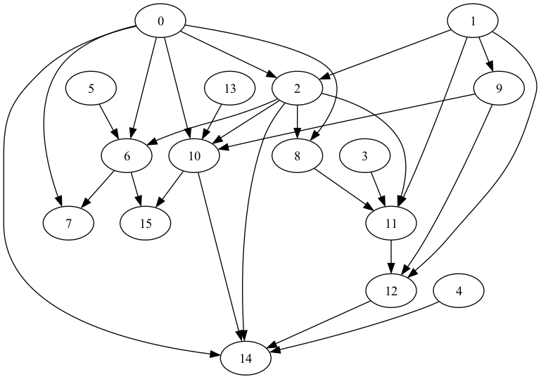

# Random DAG Generator in Go

`random-dag-generator-go` is a library for (you guessed it!) generating random 
Directed Acyclic Graphs (DAGs) in Go.

<p float="left">




</p>

## Features

- Generate random Directed Acyclic Graphs (DAGs), controlling:
  - exact quantity of nodes in the DAG
  - maximum outdegree of each node
  - probability of adding new edges during graph generation
- Render a DAG using graphviz and DOT

## Demo

```go
package main

import (
	"flag"
	"math/rand"

	dag "github.com/laser/random-dag-generator-go"
	gvz "github.com/laser/random-dag-generator-go/render/graphviz"
)

func main() {
	flag.Parse()

	graph := dag.Random(
		dag.WithNodeQty(10),
		dag.WithMaxOutdegree(3),
		dag.WithEdgeFactor(0.5))

	converted := gvz.From(graph)

	gvz.RenderTo(converted, "/tmp/flarp.png")
}
```
